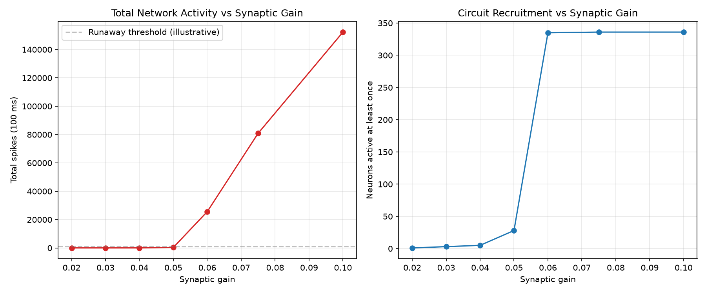
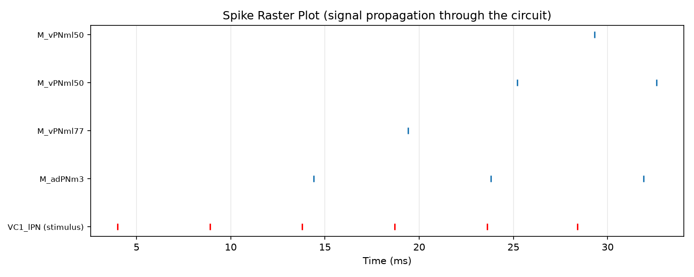
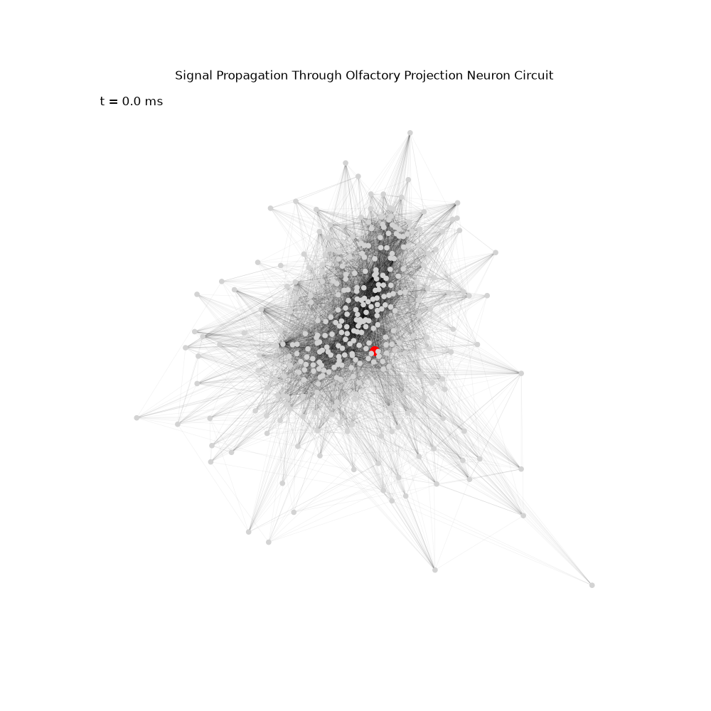
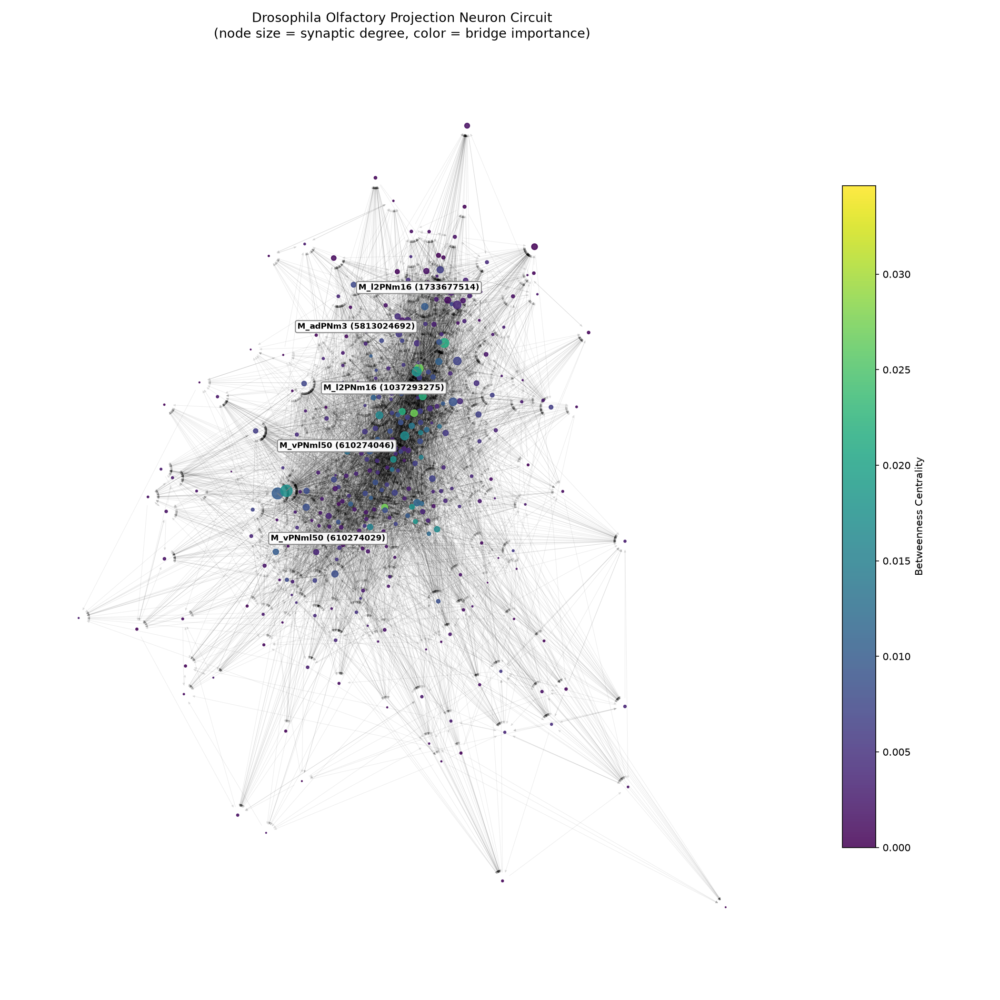

# Fly Brain Signal Simulator

A simulation of signal propagation through a real Drosophila (fruit fly) 
neural circuit, built on actual connectome data from Janelia's hemibrain 
dataset.

> Combines real neuroscience data (via neuPrint) with a biophysical 
> spiking neuron model (Leaky Integrate-and-Fire) to simulate how a 
> stimulus actually propagates through a real fly brain circuit.

## Overview

This project fetches real neuron and synapse data for the Drosophila 
olfactory projection neuron circuit, analyzes it as a network, then 
simulates electrical signal propagation across it using a biologically 
grounded spiking neuron model — the same class of model used in 
computational neuroscience research.

## Features

- 🧠 Real connectome data (336 neurons, 9,123 real synapses) from Janelia's hemibrain dataset via neuPrint
- 🕸️ Network analysis: hub neurons, bridge (betweenness) neurons, degree distribution
- ⚡ Leaky Integrate-and-Fire (LIF) neuron model, validated against expected f-I curve behavior
- 🔥 Full-circuit spiking simulation with synaptic current decay (temporal summation)
- 📊 Synaptic gain sensitivity analysis revealing a critical phase transition
- 📈 Spike raster plot and animated signal propagation visualization

## How It Works

### 1. Real Data Acquisition

Neuron and synapse data for antennal-lobe projection neurons (the cells 
carrying olfactory signals to higher brain regions) is fetched via the 
`neuprint-python` API from Janelia's public hemibrain connectome — the 
same dataset used in published neuroscience research.

### 2. Network Analysis

The circuit is represented as a directed, weighted graph (`networkx`), 
with neurons as nodes and synapse counts as edge weights. Betweenness 
centrality and degree analysis identify structurally important neurons — 
both high-connectivity "hubs" and low-connectivity "bridge" neurons that 
sit on many signal paths despite modest connectivity.

### 3. Spiking Neuron Model

Each neuron is modeled with the Leaky Integrate-and-Fire equation:
```bash
τ dV/dt = -(V - V_rest) + R·I(t)
```


When membrane potential crosses threshold, the neuron fires and resets. 
The single-neuron model was validated against the expected current-firing 
rate (f-I curve) relationship before being scaled to the full network.

### 4. Network Simulation

When a neuron spikes, it delivers current to its postsynaptic targets, 
scaled by the real synaptic weight from the connectome. Synaptic current 
decays exponentially (rather than acting as an instantaneous pulse), 
allowing temporal summation of successive spikes — a key property of 
real synaptic transmission.

## Key Finding: Critical Phase Transition

A systematic sweep of synaptic gain revealed a sharp transition between 
two regimes:



| Synaptic Gain | Total Spikes (100ms) | Active Neurons |
|---|---|---|
| 0.02 | 6 | 1 / 336 |
| 0.04 | 13 | 5 / 336 |
| 0.05 | 349 | 28 / 336 |
| 0.06 | 25,636 | 335 / 336 |
| 0.075 | 80,925 | 336 / 336 |

Below a critical gain (~0.05), the circuit shows sparse, limited signal 
propagation. Above it, activity explodes into network-wide runaway 
excitation — a simplified analog of the excitation/inhibition balance 
that governs real neural criticality (and whose breakdown resembles 
seizure-like activity in real brains).

## Results

Using gain = 0.04 (the "healthy," sparse propagation regime):





A stimulus injected into the circuit's highest out-degree neuron 
(`VC1_lPN`) propagates through the network over ~30ms, recruiting 
downstream neurons in an order determined entirely by the real synaptic 
connectivity — not by any artificial ordering.

## Circuit Visualization



## Project Structure

```bash
fly-brain-signal-sim/
├── fetch_circuit.py # Pull real connectome data via neuPrint
├── build_graph.py # Build NetworkX graph from raw data
├── analyze_graph.py # Hub/bridge neuron analysis
├── visualize_graph.py # Static network visualization
├── lif_neuron.py # Single-neuron LIF model + validation
├── network_simulation.py # Full-circuit spiking simulation
├── gain_sensitivity.py # Parameter sensitivity analysis
├── visualize_simulation.py # Raster plot + propagation animation
└── README.md
```

## Installation

```bash
git clone https://github.com/yavuzselimsert/fly-brain-signal-sim.git
cd fly-brain-signal-sim
pip install -r requirements.txt
```

Create a `.env` file with a free neuPrint token (from [neuprint.janelia.org](https://neuprint.janelia.org)):
NEUPRINT_TOKEN=your_token_here


## Usage

```bash
python fetch_circuit.py         # Fetch real data (requires token)
python build_graph.py           # Build the connectivity graph
python analyze_graph.py         # Network analysis
python visualize_graph.py       # Circuit visualization
python lif_neuron.py            # Validate single-neuron model
python network_simulation.py    # Run full-circuit simulation
python gain_sensitivity.py      # Parameter sweep
python visualize_simulation.py  # Generate raster plot + animation
```

## Technologies

- **Python**, **NumPy**, **Matplotlib**
- **neuPrint-python** — real connectome data access
- **NetworkX** — graph analysis
- **Leaky Integrate-and-Fire model** — biophysical spiking neuron simulation

## Motivation

Inspired by projects like FlyWire and the Janelia connectome effort — the 
mapping of an entire fruit fly brain down to the synapse — this project 
explores what becomes possible once that structural data is combined with 
a functional model: not just "what is the fly's brain wired like," but 
"what actually happens when a signal moves through it."

---

**Author:** [Yavuz Selim Sert](https://github.com/yavuzselimsert)